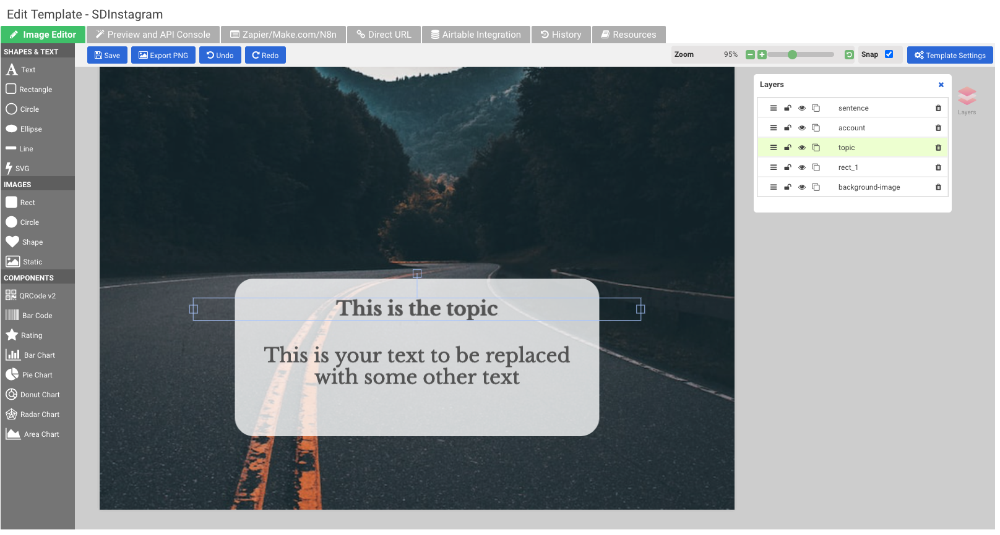

# gpt2insta

gpt2insta is a Python script which ask for a topic and does the following:

* Get a nice sentence for that topic by invoking [ChatGPT](https://chat.openai.com/chat) (e.g. for topic "Life" the sentence could be "Life is a precious gift").
* Generate an image with [Stable Diffusion](https://stablediffusionweb.com/#demo) by using the previously generated sentence as prompt.
* Add the text to the generated image by calling an already created [apitemplate](https://app.apitemplate.io/) template.
* Upload the final image to instagram.

## Configuration

Download the code from github repo

```
python3 -m venv .venv
source .venv/bin/activate
pip install -r requirements.txt
cp .env.example .env
```

Register in [apitemplate.io](https://apitemplate.io/) and create a template like this:


Edit .env file and fill in the values.

## Usage

```
./gpt2insta.py -topic Happiness

```
Enter the code sent by instagram to your email or sms.

You will get a nice story in your instagram account, like this:


## Next steps

Some ideas: 

* Translate content by calling google translate API
* Generate videos instead of images.

## Libraries and services

These are the libraries I have used. Thanks to the creators!
* [instagrapi](https://github.com/adw0rd/instagrapi)
* [pychatgpt](https://github.com/rawandahmad698/PyChatGPT)

And the services used:
* https://replicate.com/blog/run-stable-diffusion-with-an-api
* https://stablediffusionweb.com/
* https://apitemplate.io/

## Disclaimer
This code is only intended as a PoC of interconnecting several AI services.
Instagram discourages bot usage and your account can be suspended if you are trying to do massive operations programmatically. Use it at your own risk.
Also ChatGPT have not yet released a public API, so a non-official API library is used.

## Contributing

Pull requests are welcome. 

## License

[MIT](https://choosealicense.com/licenses/mit/)
